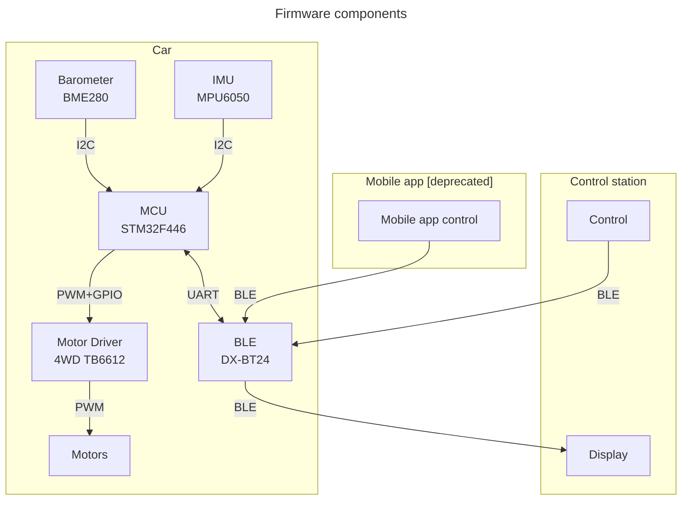

# Climber
Car climbs to a hill

## Hardware components

## Firmware components

## Future improvements and todos
- [ ] add diagram for data flow and components
- [ ] integral component in PID
- [x] create and move to the new repo
- [ ] N20 motors improve handling
- [ ] port to SpeedyBee
- [ ] error handling and reconnects for accelerometer, baro and BLE
- [ ] add led command shows task statuses
- [ ] external configuration
- [ ] beautify Python client, add doc
- [ ] record video
- [x] watchdog
- [ ] test watchdog