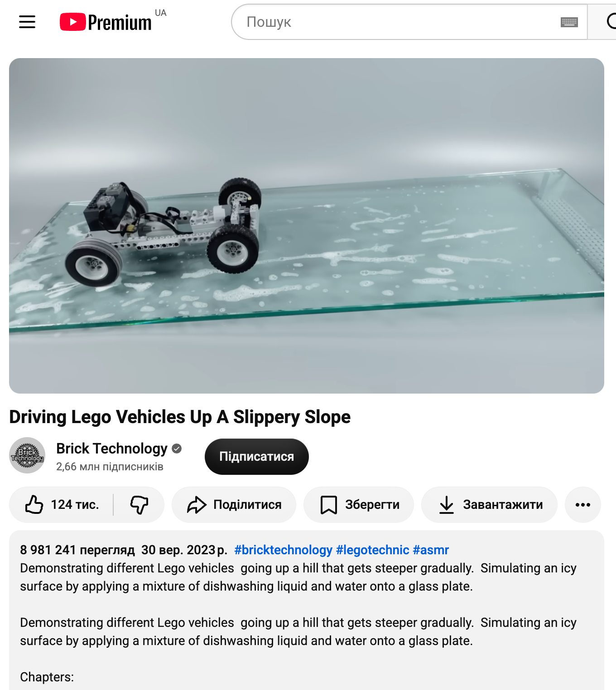
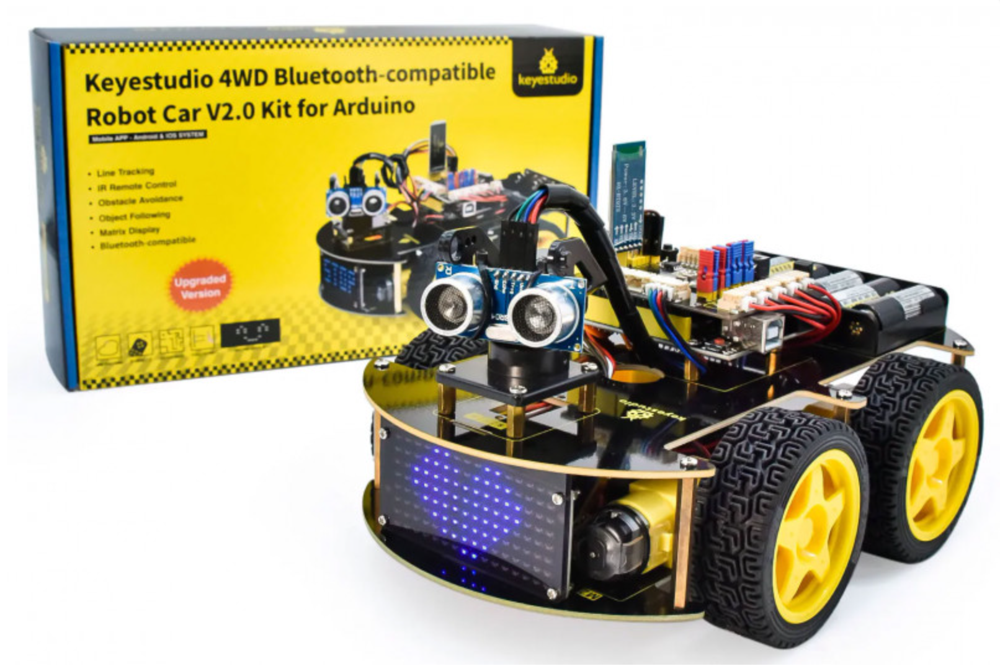
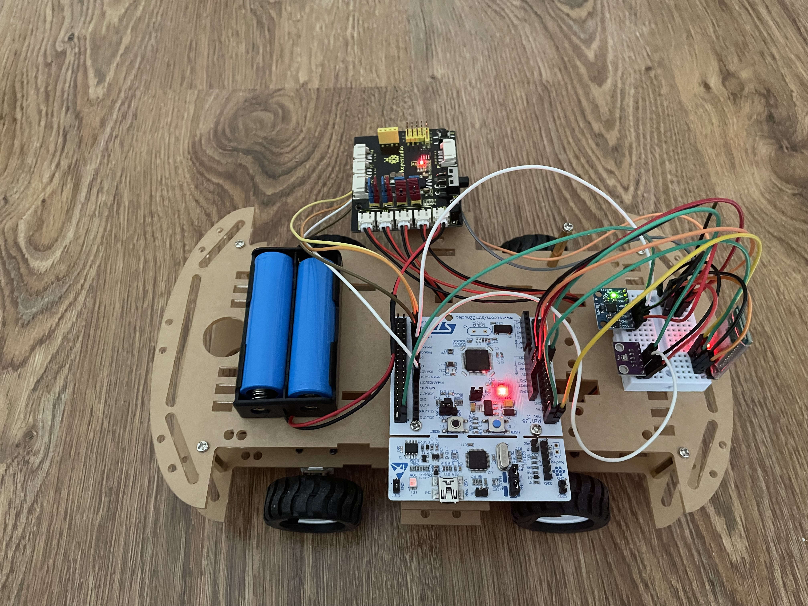
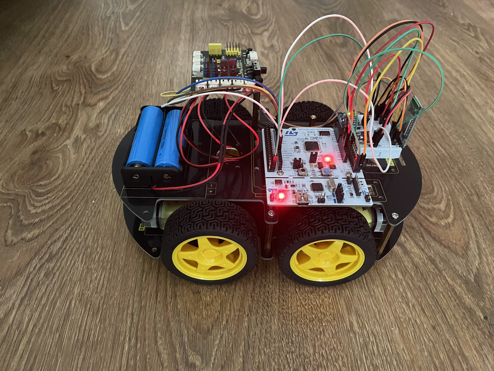
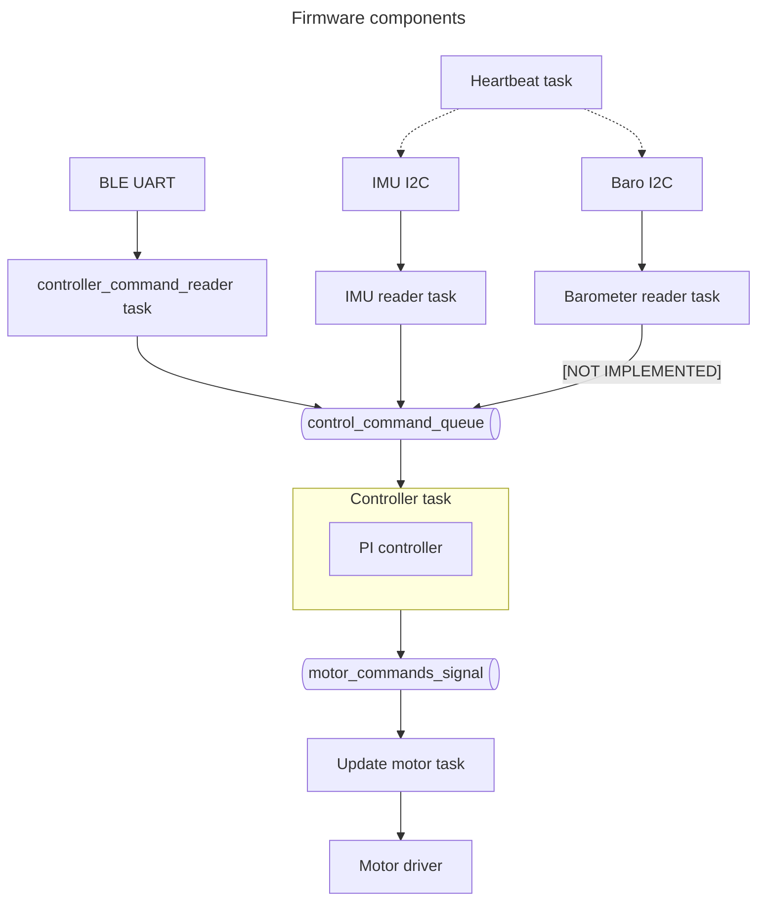

# Climber
A car climbs a hill

## Inspired by


## Chasis
Arduino Car


## Requirements
- Mise
- Rust, `probe-rs`
- `uv`

## Quick start
- flash
`mise run flash-monitor`
- setup client
```
cd ble_client
uv venv
source .venv/bin/activate
uv pip install -r requirements.txt 
```
- open client
`mise run client`


## Stages
1. Migrated from Arduino/C++ to STM32/Rust/Embassy - controlled from a mobile app via BLE
1. Added barometer, accelerometer/gyroscope
1. Replaced mobile app control with controller from notebook (written in Python) for better control and logging/telemetry
1. Migrated to N20 motors

1. Migrated back to TT motors



## Hardware components


## Firmware components


## Videos
- [controlling](media/controlling.mov)
- [auto climbing](media/auto_climbing.mov)
